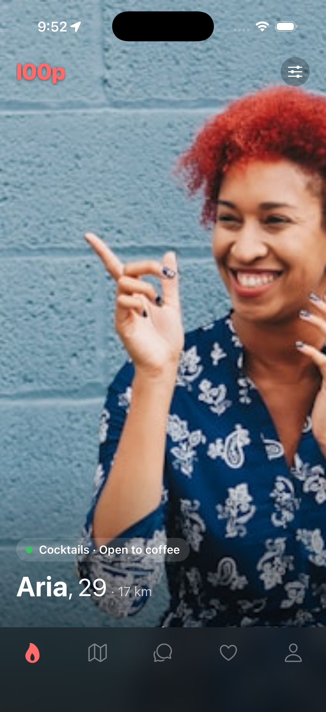
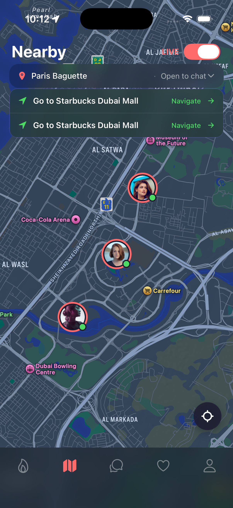
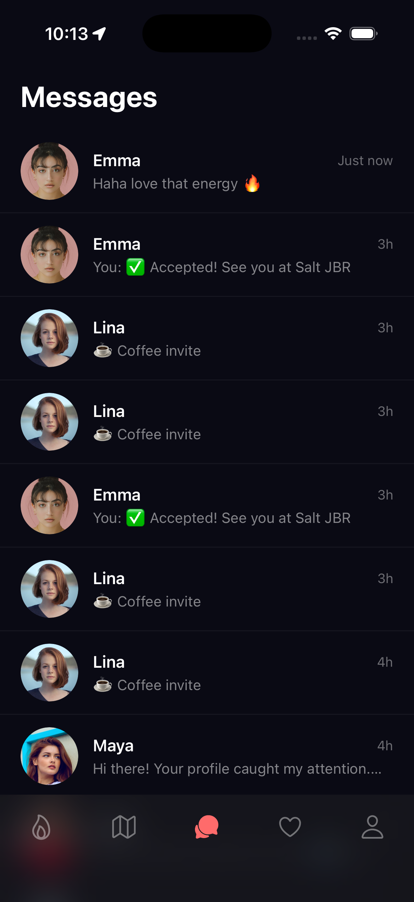
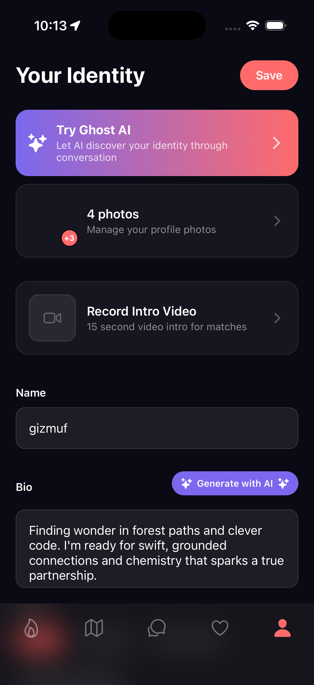

# Screen Guide

Visual tour of all l00p app screens.

## App Screenshots

| Feed | Map | Messages | Profile |
|:----:|:---:|:--------:|:-------:|
|  |  |  |  |

---

## Tab Bar Navigation

l00p has 5 main tabs at the bottom:

| Icon | Tab | Purpose |
|------|-----|---------|
| 🔥 | Feed | Discover new profiles |
| 🗺️ | Map | Nearby people on map |
| 💬 | Messages | Chat with matches |
| ❤️ | Likes | People who liked you |
| 👤 | Profile | Your settings |

---

## Feed Screen

**Location:** First tab (🔥 icon)

**Elements:**
- Full-screen profile cards
- Photo carousel (horizontal swipe within card)
- Name, age, distance at bottom
- Expand gesture (tap or swipe up)

**Expanded Card Shows:**
- All photos in grid
- Full bio
- Themes/interests
- "Looking For" section
- Action buttons (Like/Pass)

---

## Map Screen

**Location:** Second tab (🗺️ icon)

**Elements:**
- Full-screen map (centered on Dubai by default)
- User pins showing nearby profiles
- Carousel at bottom (swipeable)
- Meeting alert banner at top (if pending invites)
- "LIVE" toggle for real-time location

**Interactions:**
- Tap pin → Shows profile in carousel
- Swipe carousel → Browse profiles
- Tap carousel card → Full profile view

---

## Messages Screen

**Location:** Third tab (💬 icon)

**Elements:**
- List of all conversations
- Unread indicator (badge)
- Last message preview
- Profile photo thumbnail

**Conversation View:**
- Message bubbles
- Voice note player
- Meeting invite cards
- Keyboard with microphone button

---

## Likes You Screen

**Location:** Fourth tab (❤️ icon)

**Elements:**
- Grid/list of profiles who liked you
- Blur overlay (free users)
- Swipe gestures enabled
- Like/Pass actions

**Premium View:**
- Full unblurred photos
- Can tap to view full profile
- Instant match on right swipe

---

## Profile Screen

**Location:** Fifth tab (👤 icon)

**Sections:**
1. **Header** - Preview button, settings gear
2. **Photos** - 3x3 grid with position badges
3. **Basic Info** - Name, age, gender
4. **Location** - Home city picker
5. **About Me** - Bio text
6. **Themes** - Interest chips
7. **Looking For** - Relationship preferences

---

## Ghost Chat Screen

**Access:** From Ghost tab or AI companion icon

**Elements:**
- Chat interface with Ghost AI
- Quick-reply chips
- Text input field
- Ghost avatar

---

## Settings Screens

**Access:** Gear icon in Profile

**Blocked Users:**
- List of blocked profiles
- Unblock option

**Privacy Policy:**
- GDPR/CCPA compliant text
- Contact information

**Delete Account:**
- Warning message
- Confirm button
- Permanent deletion

---

## Modals & Sheets

**Profile Preview:**
- Full-screen preview of your profile
- How others see you

**Location Picker:**
- Search bar for cities
- Map with pin
- "Set Location" button

**Meeting Invite Sheet:**
- Venue selection
- Date/time picker
- Send button

**Report/Block Sheet:**
- Report reason options
- "Also block user" toggle
- Submit button
